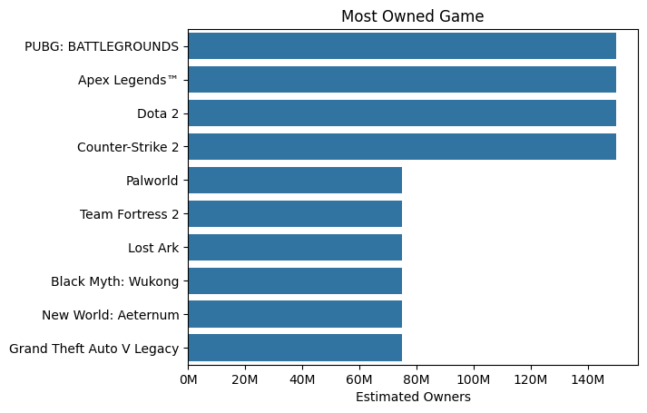
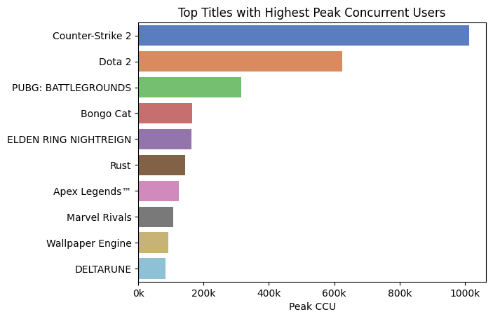
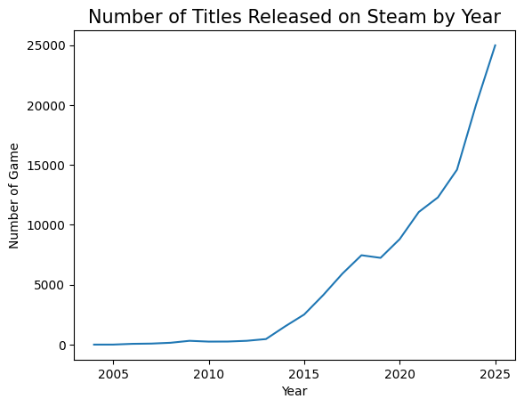
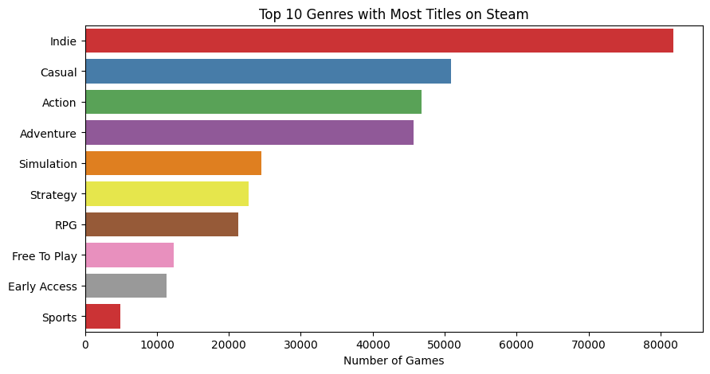
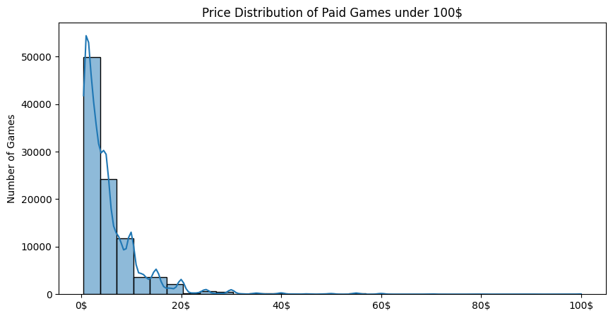
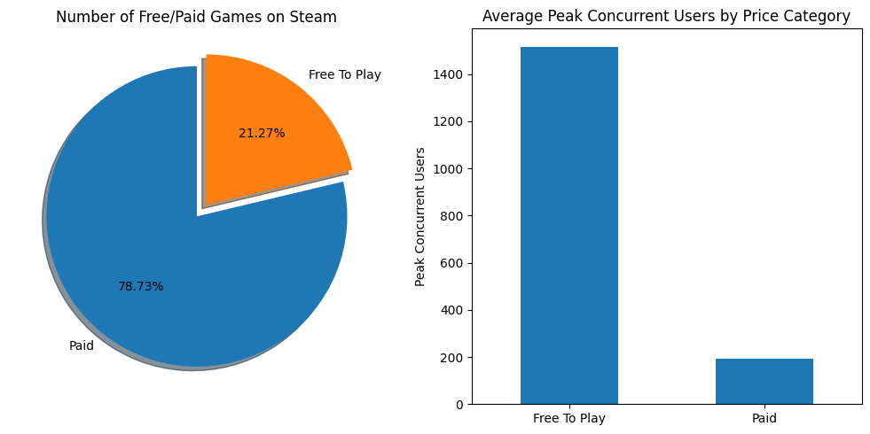
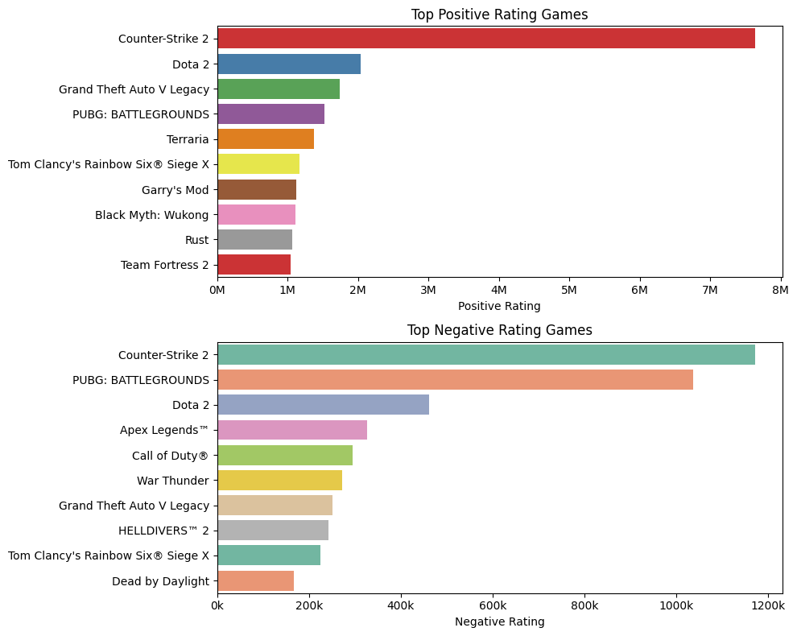
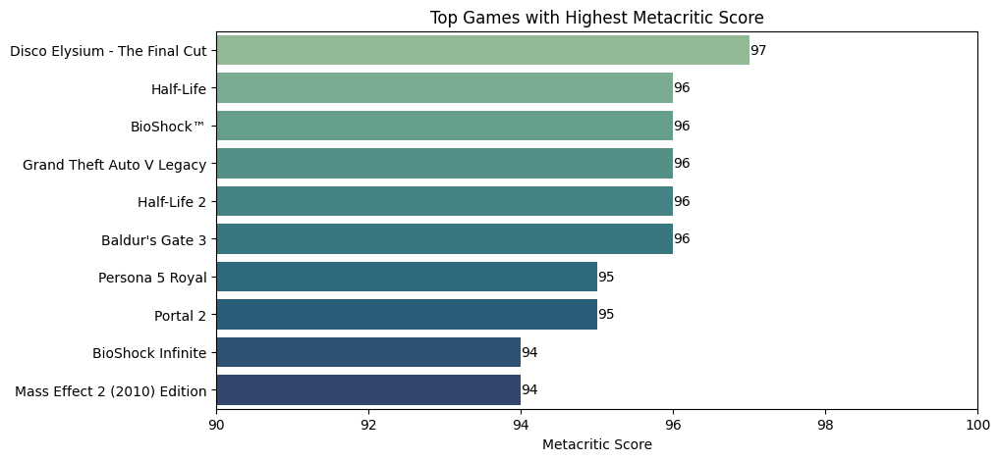
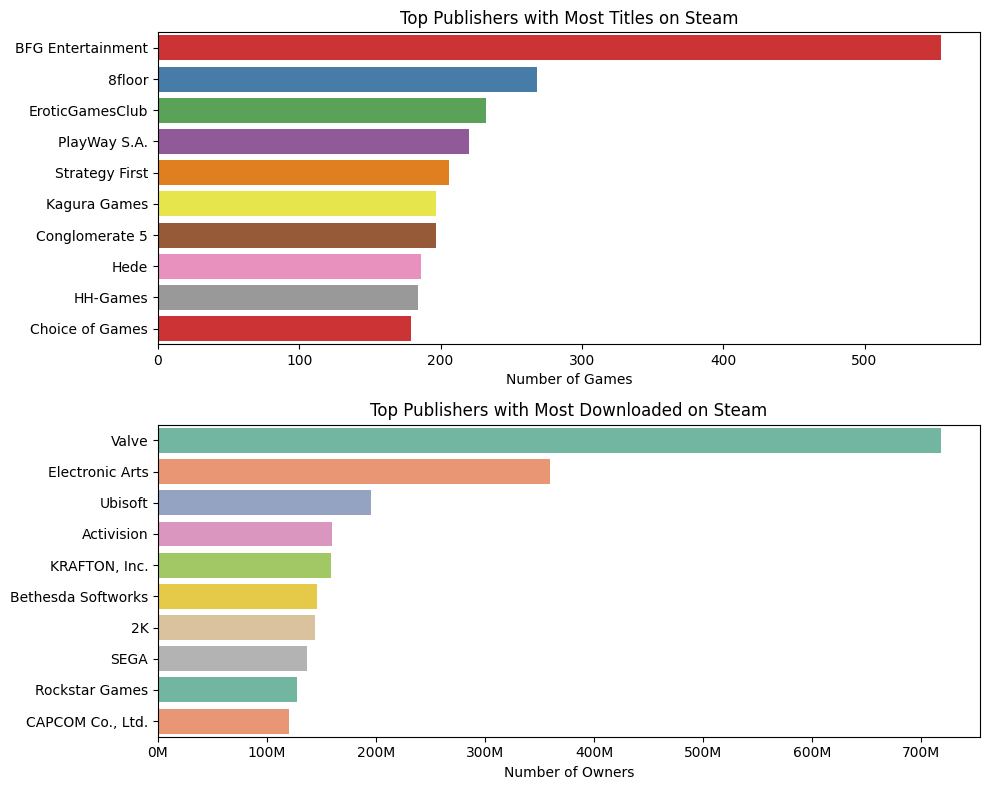

# Introduction

Welcome to my analysis of the Steam Games Market. In this project, I explored the Steam games market using Python to research and gain insights into the gaming industry on Steam. I was curious whether factors such as price, genre, developers, or publishers have any relationship with game ownership, player activity, and user ratings.

The data is sourced from the [Steam Games Dataset by FronkonGames](https://huggingface.co/datasets/FronkonGames/steam-games-dataset) on Hugging Face,  I chose this dataset over the equivalent [Kaggle version](https://www.kaggle.com/datasets/fronkongames/steam-games-dataset) because it is more complete and better formatted. Throughout this project, I cleaned the data, created visualizations, and explored different aspects of the Steam market, including release trends, pricing, player engagement, ratings, and the performance of different genres, developers, and publishers.

# The Questions

Below are the questions I want to answer in my project:


1. Which games and genres are the most popular on Steam in terms of estimated owners and player activity?
2. How has the Steam game catalog grown over time, and which genres have become the most common?
3. How do pricing strategies, especially Free-to-Play vs. Paid games, relate to game popularity?
4. How are games received by players and critics, and which publishers stand out based on ratings and reviews?

# Tools I Used

For this deep dive into the Steam games market, I used the following tools:

- **Python:** The backbone of my analysis, allowing me to analyze the data and find critical insights. I also used the following Python libraries:
    - **Pandas:** For loading, cleaning, and manipulating the dataset.
    - **NumPy:** For numeric operations and handling data type conversions.
    - **Matplotlib:** For building the core visualizations.
    - **Seaborn:** For more polished and advanced charts.
- **Jupyter Notebooks:** To run my analysis while keeping notes and results together.
- **Visual Studio Code:** My go-to editor for writing and running the notebooks.
- **Git & GitHub:** For version control and sharing my code and analysis.
project tracking.


# Data Preparation and Cleanup

This section outlines the steps taken to prepare the data for analysis, ensuring accuracy and usability.

## Import & Load Data

I start by importing the necessary libraries and loading the dataset directly from Hugging Face.

```python
import pandas as pd
from datasets import load_dataset
import matplotlib.pyplot as plt
import seaborn as sns
import numpy as np

df = pd.read_parquet("hf://datasets/FronkonGames/steam-games-dataset/data/train-00000-of-00001.parquet")
```

## Drop Columns

A first look with `df.info()` showed no missing values, but many columns actually had missing data encoded as empty strings or placeholders  instead of actual `NaN`s values. 

After inspecting each column, I dropped the ones that were mostly empty or not useful for analysis.

```python
df_clean = df.drop(columns=['user_score', 'score_rank', 'notes', 'reviews', 'metacritic_url', 'detailed_description', 'short_description', 'header_image', 'website', 'support_url', 'recommendations', 'screenshots', 'movies', 'support_email']).copy()
```

## Fix Data Types

Several columns needed to be converted to the correct type.

```python
# String to Integer
df_clean['appID'] = df_clean['appID'].astype(int)
# Formatting Date
df_clean['release_date'] = pd.to_datetime(df_clean['release_date'])
# int64 -> int16 for faster processing and save memory
col_int16 = ['required_age', 
             'dlc_count', 
             'metacritic_score', 
             'achievements', 
             'average_playtime_2weeks', 
             'median_playtime_2weeks']
df_clean[col_int16] = df_clean[col_int16].astype('int16')
```

I also engineered a few extra useful columns used throughout the analysis:
```python
# Mean Estimated Owners: midpoint of the 'estimated_owners' range.
df['mean_estimated_owners'] = df['estimated_owners'].str.split(' - ', expand=True).astype(float).mean(axis=1)
# Release Year
df['release_year'] = df['release_date'].dt.year
# Release Month
df['release_month'] = df['release_date'].dt.month
# Price Category ('Paid' / 'Free To Play')
df['price_category'] = np.where(df['price'] > 0, 'Paid', 'Free')
```

# The Analysis

Each Jupyter Notebook for this project aimed at investigating specific aspects of the Steam Games Market. Here's how I approached each one:

## 1. Market Overview: Ownership, Player Engagement & Genre Trends

I looked at which games attract the most owners and players, how release volume has changed over the years, and which genres dominate the catalog.

View my notebook with detailed steps here: [02_EDA_Market_Overview](02_EDA_Market_Overview.ipynb).

### Most Owned Games

```python
plot = df2[['name', 'mean_estimated_owners']].sort_values(by='mean_estimated_owners', ascending=False).head(10)
fig, ax = plt.subplots()
sns.barplot(data=plot, x='mean_estimated_owners', y='name')
ax.xaxis.set_major_formatter(ticker.FuncFormatter(lambda x, pos: f'{x*1e-6:.0f}M'))
ax.set_xlabel("Estimated Owners")
ax.set_ylabel("")
ax.set_title("Most Owned Game")
plt.show()
```



**Insights:**
- The top of the chart is dominated by well-known multiplayer titles.
- Since `estimated_owners` is stored as a range (e.g. 100M – 200M) rather than an exact value, I calculate the midpoint of each range, which results in several games sharing the same estimated ownership.

### Peak Concurrent Users

```python
plot1 = df2[df2['peak_ccu'] > 0][['name', 'peak_ccu']].sort_values(by='peak_ccu', ascending=False).head(10)
fig, ax = plt.subplots()
sns.barplot(data=plot1, x='peak_ccu', y='name', hue='name', palette='muted')
ax.xaxis.set_major_formatter(ticker.FuncFormatter(lambda x, pos: f'{x*1e-3:.0f}k'))
ax.set_xlabel("Peak CCU")
ax.set_ylabel("")
ax.set_title("Top Titles with Highest Peak Concurrent Users")
plt.show()
plt.show()
```



**Insights:**
- Valve's main multiplayer titles (**Counter-Strike 2** and **Dota 2**) and battle royales like **PUBG: BATTLEGROUNDS** continue to hold the highest concentration of active concurrent players on the platform.


### Number of Titles Released on Steam by Year

```python
df2.groupby('release_year').size().plot()
plt.xlabel('Year')
plt.ylabel('Number of Game')
plt.title('Number of Titles Released on Steam by Year', fontsize=15)
plt.show()
```



**Insights:**
- The number of titles released on Steam has grown substantially over the years, especially in the last 5 years.
- The monthly release pattern is very similar across 2024 and 2025: more games launch as the year goes on, peaking around October–November. This reflects how much easier it has become for developers to publish games on the platform.

### Top Genres on Steam

```python
fig, ax = plt.subplots(figsize=(10,5))
sns.barplot(x=plot1.values, y=plot1.index, hue=plot1.index, palette="Set1")
ax.set_xlabel('Number of Games')
ax.set_ylabel('')
ax.set_title('Top 10 Genres with Most Titles on Steam')
plt.show()
```




**Insights:**
- Genres such as Indie, Casual, and Action dominate the Steam catalog. 
- However, the genres with the most titles are not always the same genres with the highest total ownership or the highest average concurrent users, a large content library doesn't automatically translate into large audiences.

## 2. Pricing, Ratings & Key Players

Next, I explores how games are priced on Steam, how Free-to-Play games compare with Paid games, and how players and critics rate different titles.

View my notebook with detailed steps here: [03_EDA_Pricing_and_Ratings](03_EDA_Pricing_and_Ratings.ipynb).

### Price Distribution

```python
fig, ax = plt.subplots(figsize=(10,5))
sns.histplot(df2[(df2['price_category'] == 'Paid') & (df['price'] < 100)]['price'], bins=30, kde=True)
plt.title('Price Distribution of Paid Games under 100$')
plt.xlabel('')
ax.xaxis.set_major_formatter(ticker.FuncFormatter(lambda x, pos: f'{x:.0f}$'))
plt.ylabel('Number of Games')
plt.show()
```


**Insights:**
- Most paid games are priced well below $100, with the majority concentrated in the lower price ranges. Only a small number of games are sold at much higher prices.

### Free-to-Play vs. Paid

```python
df2['price_category'].value_counts().plot(kind='pie', startangle=90, autopct='%1.2f%%', shadow=True)
plt.title('Number of Free/Paid Games on Steam')
plt.show()
```




**Insights:**
- Free-to-Play games are the clear minority by count, but they dominate in average ownership and player engagement.
- Many of Steam's biggest multiplayer titles are free, making them easier to access and helping them build much larger active player communities.


### Player & Critic Ratings

```python
fig, ax = plt.subplots(figsize=(10, 5))
sns.barplot(data=plot1, x='metacritic_score', y='name', hue='name', palette='crest')
ax.set_xlabel("Metacritic Score")
ax.set_ylabel("")
for container in ax.containers:
    ax.bar_label(container)
ax.set_title("Top Games with Highest Metacritic Score")
ax.set_xlim(90, 100)
plt.show()
```




**Insights:**
- Games with the highest number of positive and negative reviews are usually the same large titles with massive player communities. The more players a game has, the more feedback it naturally receives.
- While only some Steam games have a Metacritic score, the highest-rated titles are mostly well-known classics.
- It was also nice to see one of my favorite games, [Persona 5 Royal](https://www.metacritic.com/game/persona-5-royal/), among them.


### Publishers Analysis

```python
sns.barplot(x=plot1.values, y=plot1.index, hue=plot1.index, palette="Set1", ax=ax[0])
...
sns.barplot(x=plot2.values, y=plot2.index, hue=plot2.index, palette="Set2", ax=ax[1])
...
```



**Insights:**
- Some developers and publishers release a large number of titles without necessarily topping the ownership charts. Releasing fewer games doesn't necessarily mean having less impact if those titles attract a large and active player base.


# What I Learned

Throughout this project, I strengthened my Python data analysis skills, particularly around cleaning data and turning it into clear visual stories. This project also gave me more experience working with a real-world dataset instead of small practice datasets. Here are a few specific things I learned:

- **Advanced Python Usage**: I became more familiar with using Pandas for data cleaning and manipulation, while Matplotlib and Seaborn helped me create different types of visualizations throughout the project.
- **Choosing appropriate visualizations:** Different charts tell different stories, so picking the right one made the analysis easier to understand.
- **Improving data preprocessing:** I also became more comfortable converting data types, creating new features and organizing the dataset before analysis.


# Challenges I Faced

This project was not without its challenges, but it provided good learning opportunities:
- **Cleaning the dataset:**  Handling missing or inconsistent data entries requires careful consideration and thorough data-cleaning techniques to ensure the integrity of the analysis.
- **Complex Data Visualization**: Designing effective visual representations of complex datasets was challenging but critical for conveying insights clearly and compellingly.
- **Range-based metrics:** Working with `estimated_owners` as a range rather than an exact value made it tricky to rank and compare top games without acknowledging the resulting ties.

# Conclusion
This project gave me a chance to work with a large real-world dataset and practice the complete data analysis process, from data cleaning to creating visualizations and interpreting the results.
Although this is a relatively small project, it helped me better understand the Steam games market and gave me more experience using Python for exploratory data analysis. There are still many questions that could be explored further, but I'm happy with what I learned from this project.
